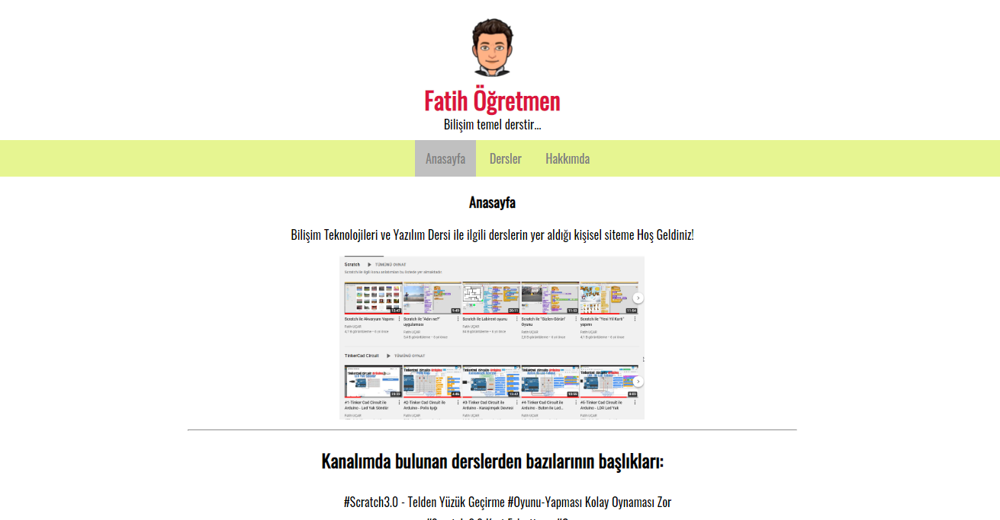

# CSS Ödev-1

Kodluyoruz Eğitimi için CSS konusunda ilk ödevim.

Bu repo kişisel web sayfası ödev çalışmasıdır. Sitede [Youtube](https://www.youtube.com/c/FatihU%C3%87AR07/featured) kanalımdaki derslerden bazılarının linkleri bulunmaktadır.



## Dersler
* Scratch
* Ofis
* GIMP
* Genel Bilgisayar Kullanımı

konularındadır.

## Kod Örneği de bulunsun
```
print("Merhaba Dünya")
```

> Alıntılarda burada yer alacak...
